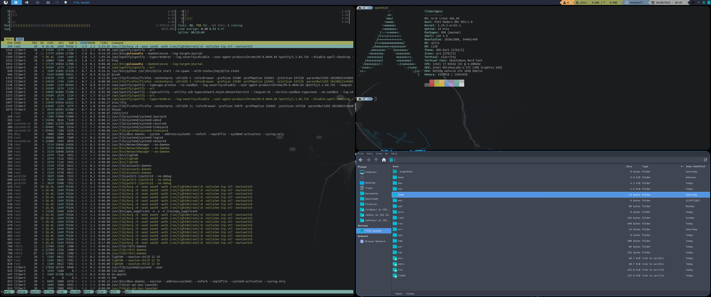

# Índice 
- [Resumen](#resumen) 
- [Paquetes base](#paquetes-base) 
- [Gestor de ventanas](#gestor-de-ventanas) 
- [Fuentes](#fuentes) 
- [Configuración X](#configuracion-x) 
- [Personalizando qtile](#personalizando-qtile) 
- [Keybindings](#keybindings)
- [Menú](#menu) 
- [Shell](#shell) 
- [GTK](#gtk) 
- [GDM](#gdm) 

# Resumen 
Esta es una guía para la configuración de Qtail partiendo de una instalación de Arch Linux como base. 

#Paquetes base 
Una vez disponemos del sistema base instalaremos los siguientes paquetes para poder posteriormente iniciar una sesión gráfica y trabajar con mayor facilidad. Para ello haremos uso del gestor de paquetes de Arch pacman. 

```bash 
pacman -S networkmanager wpa_supplicant nano neovim bat exa git which wget p7zip python-pip xrog xorg-server 
``` 
Una vez instalados iniciaremos los servicios de red para disponer de ella cuando reiníciennos. 
```bash 
systemctl enable NetworkManager 
systemctl enable wpa_supplicant 
``` 
Instalaremos también paru, un ayudante de pacman que nos permitirá instalar paquetes de la comunidad. 
```bash 
git clone http://aur.archlinux.org/paru-bin.git 
cd paru-bin 
makepkg -si 
```
# Gestor de ventanas 
A continuación, instalaremos los paquetes necesarios para la instalación y puesta en marcha de qtile. 

```bash 
pacman -S pulseaudio pavucontrol pamixer alacritty xterm qtile lightdm lightdm-gtk-greeter rofi feh picom brightnessctl network-manager-applet udiskie ntfs-3g xdg-utils xorg-xinit arandr libnotify notification-daemon zsh 
``` 
Instalaremos también un paquete necesario de python. 
```bash 
pip install psutil  
``` 
Y iniciaremos el servicio de lightdm para poder logarnos con entorno gráfico. 
```bash 
systemctl enable lightdm 

``` 

# Fuentes 
Instalaremos algunas fuentes necesarias ya que se están usando en distintas configuraciones. 
```bash 
pacman –S ttf-dejavu ttf-liberation noto-fonts 
``` 
Instalaremos también las nerd fonts desde el repositorio de AUR. 
```bash 
paru –S nerd-fonts-complete 
``` 
En este punto podemos reiniciar para entrar por primera vez en qtile, en su configuración por defecto. 

# Configuración X 
En este punto posiblemente la resolución no sea la adecuada o el sistema no haya detectado el número de monitores de que disponemos. 
Para ayudarnos en la configuración de las X usaremos **arandr**, lo ejecutaremos desde una terminal presionando la tecla [windows] + [enter]. 
Desde su interfaz grafico podemos confgigurar los monitores, aplicar los cambios para la sesión y guardar la configuración que usaremos a continuación en nuestro fichero .xprofile. 

#Personalizando qtile 
Lo primero que debemos realizar es clonar el repositorio con las configuraciones. 
```bash 

cd Downloads 
git clone https://github.com/lliwi/qtile.git 
``` 
Posteriormente realizaremos un backup de la configuración por defecto y copiaremos la nuestra. 
```bash 
cd .config 
mv qtile qtile.back 
cp –r ~/Downloads/qtile/ . 
cp –r ~/Downloads/alacritty . 
``` 
Con ello dispondremos de las keymaps, con lo que presionando [windows]+[shift]+[r] podremos recargar la configuración y verificar que ha aplicado los nuevos estilos. 
Para finalizar copiaremos el fichero .xprofile a la raiz de nutra home. 
```bash 
cp  .xprofile  ~ 
``` 
Lo abriremos con un editor de texto y modificaremos la siguiente línea indicando el fondo de escritorio que deseemos. 
```bash 

feh --bg-scale ~/Pictures/Wallpapers/YOUR_WALLPAPER.jpg & 

``` 
# Keybindings


| Key                     | Action                           |
| ----------------------- | -------------------------------- |
| **mod + j**             | next window (down)               |
| **mod + u**             | next window (up)                 |
| **mod + h**             | next window (left)               |
| **mod + k**             | next window (right)              |
| **mod + tab**           | change layout                    |
| **mod + [1-9]**         | Switch to workspace N (1-9)      |
| **mod + shift + [1-9]** | Send Window to workspace N (1-9) |
| **mod + period**        | Focus next monitor               |
| **mod + comma**         | Focus previous monitor           |
| **mod + w**             | kill window                      |
| **mod + ctrl + r**      | restart wm                       |
| **mod + ctrl + q**      | quit                             |
| **mod + m**             | manu                             |
| **mod + b**             | Firexofx                         |
| **mod + return**        | Terminal                         |
| **mod + e**             | File explorer                    |
| **mod + r**             | Red shift                        |
| **mod + s**             | Screenshot                       |


# Menú 
Ahora podemos ejecutar rofi, que será el menú para poder lanzar aplicaciones. Lo podemos realizar presionando [windows]+[m]. 
Para personalizarlo podemos ejecutar desde una shell el siguiente comando, que nos permitirá seleccionar el tema. 
```bash 
rofi-theme-selector 
``` 

#Shell 
Para la shell usemos alacritty, de la que ya hemos copiado su configuracion durante la personalizacición de qtile. 
Personalizaremos la shell con oh-my-zsh, para instalarlo realizaremos los siguientes pasos. 
Establacemos zsh como interprete por defecto. 
``bash 
chsh -s $(which zsh) 
``` 
Instalamos oh-my-zsh: 
```bash 
sh -c "$(curl -fsSL https://raw.github.com/robbyrussell/oh-my-zsh/master/tools/install.sh)" 
``` 
Descargaremos el tema y un par de plugins: 
```bash 
git clone --depth=1 https://github.com/romkatv/powerlevel10k.git ${ZSH_CUSTOM:-~/.oh-my-zsh/custom}/themes/powerlevel10k 
git clone https://github.com/zsh-users/zsh-syntax-highlighting.git ${ZSH_CUSTOM:-~/.oh-my-zsh/custom}/plugins/zsh-syntax-highlighting 
git clone https://github.com/zsh-users/zsh-autosuggestions ${ZSH_CUSTOM:-~/.oh-my-zsh/custom}/plugins/zsh-autosuggestions 
``` 
Modificaremos el fichero de configuración de **.zshrc** estableciendo el nuevo tema y los nuevos plugins. 
+ `ZSH_THEME="powerlevel10k/powerlevel10k"` 
+ plugins=(git zsh-syntax-highlighting zsh-autosuggestions) 
Podemos aprovechar para añadir algunos alias de utilidad el final del mismo fichero. 
``bash 
alias ll='lsd -lh --group-dirs=first' 
alias la='lsd -a --group-dirs=first' 
alias l='lsd -lsd --group-dirs=first' 
alias lla='lsd -lha --group-dirs=first' 
alias ls='lsd --group-dirs=first' 
alias cat='bat --style plain --paging never' 
alias tree='exa -T' 
``` 
Al iniciar una nueva terminal nos tendría que aparecer el wizard que nos guiará para la configuración de oh-my-zsh.  
En este punto, si le queremos dar transparencia a la shell o a cualquier otra aplicación lo podemos realizar con la herramienta picom. 
Añadiremos al fichero /etc/xdg/picom.conf la siguinete linea: 
+ opacity-rule = [ "90:class_g = 'Alacritty'" ]; 
Si queremos redondear las esquinas de nuestras ventas lo podemos realizar añadiendo la siguiente línea al mismo fichero de configuración. 
+ opacity-rule = [ "90:class_g = 'Alacritty'" ]; 

#GTK 
Ahora nos podemos poner con el tema del gestor de ficheros, simplemente tenemos que copiar las carpetas proporcionadas con la configuración a las carpetas correspondientes según sean iconos, temas o cursores. 
``bash 
cp –r thems/gtk/ara /usr/share/icons 
cp –r thems/cursor/Breeze /usr/share/icons 
cp –r thems/gtk/ARK-Dark /usr/share/themes 
``` 
Instalamos el paquete cxb-util-curson para que nos permita modificar el corsor. 
``bash 
sudo pacman -S xcb-util-cursor 
``` 
Y para finalizar editamos los siguientes ficheros añadiendo los nuevos temas. 
```ini 
# ~/.gtkrc-2.0 
gtk-theme-name = "ARK-Dark" 
gtk-icon-theme-name = "ara" 
gtk-cursor-theme-name = "Breeze" 
# ~/.config/gtk-3.0/settings.ini 
gtk-theme-name = "ARK-Dark" 
gtk-icon-theme-name = "ara" 
gtk-cursor-theme-name = "Breeze" 
#/usr/share/icons/default/index.theme 
[Icon Theme] 
Inherits = Breeze 
```

#GDM 
Para finalizar instalaremos un tema al gestor GDM para el inicio de sesión. 
```bash 
pacman -S lightdm-webkit2-greeter 
paru -S lightdm-webkit-theme-aether 
``` 
Modificaremos los siguientes archivos de configuración: 
```ini 
# /etc/lightdm/lightdm.conf 
[Seat:*] 
# ... 
# Descomentando la siguiente línea y estableciendo el valor. 
greeter-session = lightdm-webkit2-greeter 
# ... 
# /etc/lightdm/lightdm-webkit2-greeter.conf 
[greeter] 
# ... 
webkit_theme = lightdm-webkit-theme-aether 
``` 
